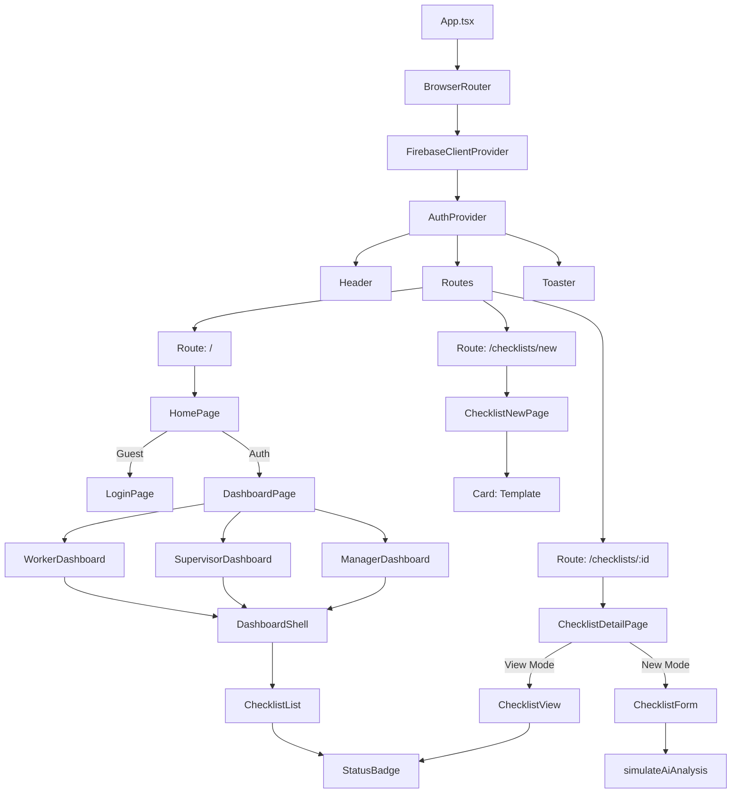

# Component Architecture & Analysis

This document documents the component structure of the Safety Management Studio (Vite + React) and analyzes recent architectural improvements.

## 1. Component Tree

## 2. Structural Improvements

### A. Layout Abstraction (`DashboardShell`)
*   **Before**: Each dashboard file (`WorkerDashboard`, etc.) repeated the same container divs, header logic, and styling classes.
*   **After**: A generic `DashboardShell` component handles the page title, description, action buttons (top-right), and entry animations. This reduces code duplication by ~30% in dashboard files.

### B. Logic Centralization (`useChecklistQuery`)
*   **Before**: Firestore query logic (`collection`, `where`, `orderBy`) was repeated in every dashboard component.
*   **After**: A custom hook `useChecklistQuery(role)` accepts the user role and returns the appropriate data stream. This separates **Data Fetching** concerns from **UI Presentation**.

### C. UI Standardization (`StatusBadge`, `Card`)
*   **StatusBadge**: Centralizes the color mapping for status (`submitted`, `approved`) and risk levels (`Safe`, `Danger`). Changing a color scheme now requires editing only one file.
*   **Card Variants**: The `Card` component was refactored using `cva` (class-variance-authority) to support variants like `destructive` (for risk items) or `success`, removing ad-hoc Tailwind classes from feature code.

### D. State Management
*   **Refresh Logic**: A `refresh` mechanism was added to the `useCollection` hook, allowing manual re-fetching of Firestore data without page reloads, improving the UX for managers monitoring real-time data.

## 3. Directory Structure

| Path | Purpose |
| :--- | :--- |
| `src/components/ui` | Atomic design elements (Button, Card, Badge). Reusable across the app. |
| `src/components/layout` | Structural components (Header, DashboardShell). |
| `src/components/checklist` | Feature-specific logic for Checklists (Form, View, List). |
| `src/components/dashboard` | Role-specific page views. |
| `src/hooks` | Custom React hooks (`use-checklist-query`, `use-mobile`). |
| `src/firebase` | Firebase configuration and core data hooks (`use-collection`). |

