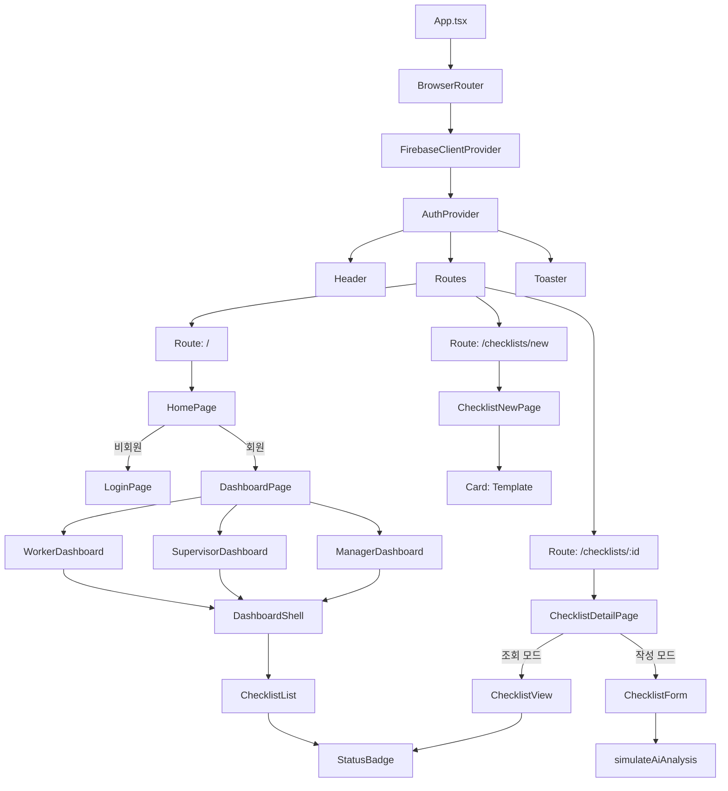

# 컴포넌트 아키텍처 및 분석

이 문서는 안전의 길(Vite + React)의 컴포넌트 구조를 기록하고 최근 아키텍처 개선 사항을 분석합니다.

## 1. 컴포넌트 트리

## 2. 구조적 개선 사항

### A. 레이아웃 추상화 (`DashboardShell`)
*   **이전**: 각 대시보드 파일(`WorkerDashboard` 등)이 동일한 컨테이너 div, 헤더 로직, 스타일링 클래스를 반복했습니다.
*   **이후**: 일반화된 `DashboardShell` 컴포넌트가 페이지 제목, 설명, 작업 버튼(우측 상단), 진입 애니메이션을 처리합니다. 이를 통해 대시보드 파일의 코드 중복을 약 30% 줄였습니다.

### B. 로직 중앙화 (`useChecklistQuery`)
*   **이전**: Firestore 쿼리 로직(`collection`, `where`, `orderBy`)이 모든 대시보드 컴포넌트에서 반복되었습니다.
*   **이후**: 사용자 역할을 인자로 받는 커스텀 훅 `useChecklistQuery(role)`가 적절한 데이터 스트림을 반환합니다. 이는 **데이터 페칭** 관심사와 **UI 프레젠테이션** 관심사를 분리합니다.

### C. UI 표준화 (`StatusBadge`, `Card`)
*   **StatusBadge**: 상태(`submitted`, `approved`)와 위험 수준(`Safe`, `Danger`)에 대한 색상 매핑을 중앙화했습니다. 이제 색상 체계를 변경하려면 한 파일만 수정하면 됩니다.
*   **Card 변형**: `Card` 컴포넌트는 `cva`(class-variance-authority)를 사용하여 `destructive`(위험 항목용) 또는 `success`와 같은 변형(variant)을 지원하도록 리팩토링되었으며, 기능 코드에서 임시적인 Tailwind 클래스를 제거했습니다.

### D. 상태 관리
*   **새로고침 로직**: `useCollection` 훅에 `refresh` 메커니즘을 추가하여 페이지 리로드 없이 수동으로 Firestore 데이터를 다시 가져올 수 있게 하여, 실시간 데이터를 모니터링하는 관리자의 UX를 개선했습니다.

## 3. 디렉토리 구조

| 경로 | 목적 |
| :--- | :--- |
| `src/components/ui` | 원자적 디자인 요소 (버튼, 카드, 뱃지). 앱 전반에서 재사용 가능. |
| `src/components/layout` | 구조적 컴포넌트 (헤더, DashboardShell). |
| `src/components/checklist` | 체크리스트 기능 관련 로직 (폼, 뷰, 리스트). |
| `src/components/dashboard` | 역할별 페이지 뷰. |
| `src/hooks` | 커스텀 React 훅 (`use-checklist-query`, `use-mobile`). |
| `src/firebase` | Firebase 설정 및 핵심 데이터 훅 (`use-collection`). |
